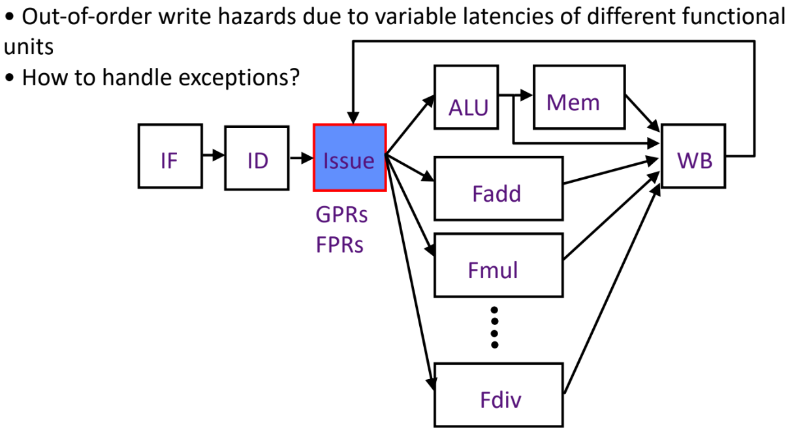
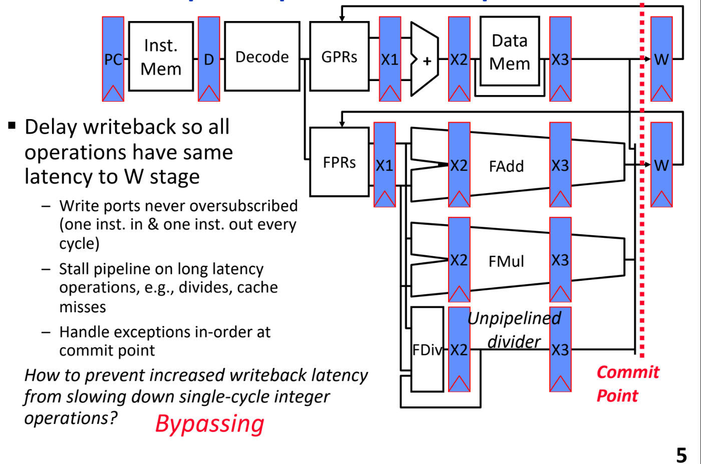
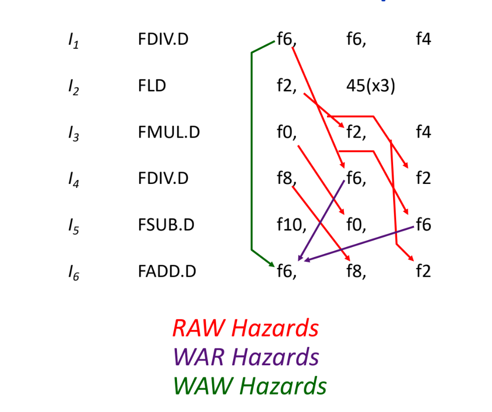

## Complex Pipelining的动机
当我们考虑下面的因素存在的时候，依然想让pipeline获得高性能，这就是Complex Pipelining的动机
- 拥有不同的功能单元，不同的功能单元拥有不同延迟，比如流水化的floating-point units
- memory system的访问时间动态变化，缓存命中或者未命中
- 多个arithmetic和memory单元，当实际写回的时候，可能会相互竞争

如果将上述的复杂因素考虑到之前的五级流水线，？？？

## Complex In-Order Pipeline
延迟写回阶段，这样让所有的操作对于W阶段有相同的延迟

## Types of Data Hazards
