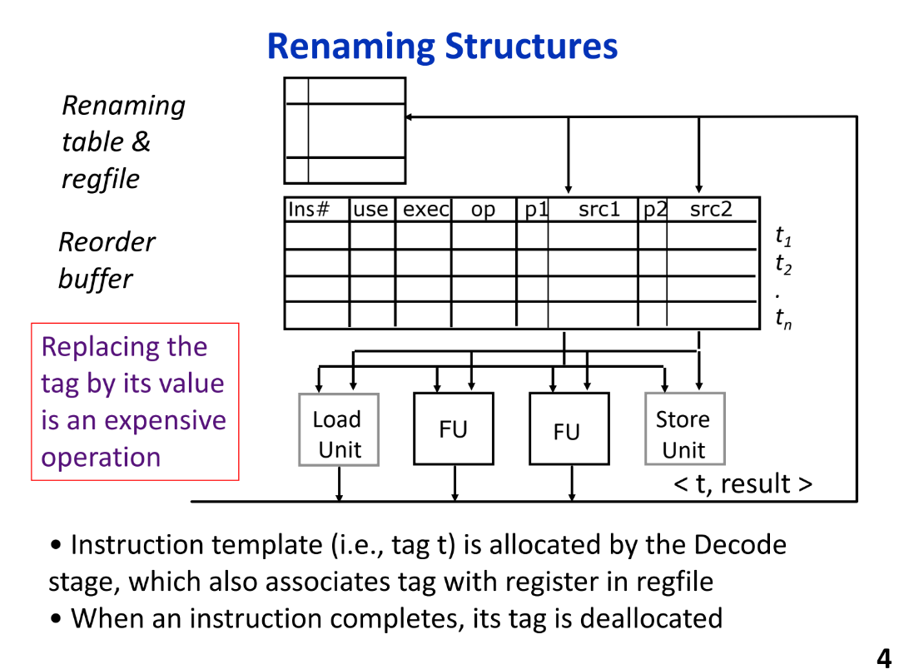

##  Tomasulo算法
- 指令dispatch(in program order)
1. 分配一个保留站(RS) `entry`
2. 如果src_reg在`register file(RF)`中P被置一，执行copy: `value in RF -----> RS中tag/data字段`,并设置RS中operand的P为1
3. 如果不在，copy: `tag in RF ---> RS`,并且设置P为0
4. 对于目的寄存器，设置RF中dest对应的entry为$tag_{dest}$,实现重命名
  
- 优先execution
1. 如果缺失operand，监视`result bus` for tag match；用value替换tag；set P
2. 当全部的operand都present，issue到FU

- Completion
1. 在result bus上broadcast$<tag_{dest}, value>$，让需要的RF和其他RS去使用
2. 释放RS entry

## Tomasulo示例
