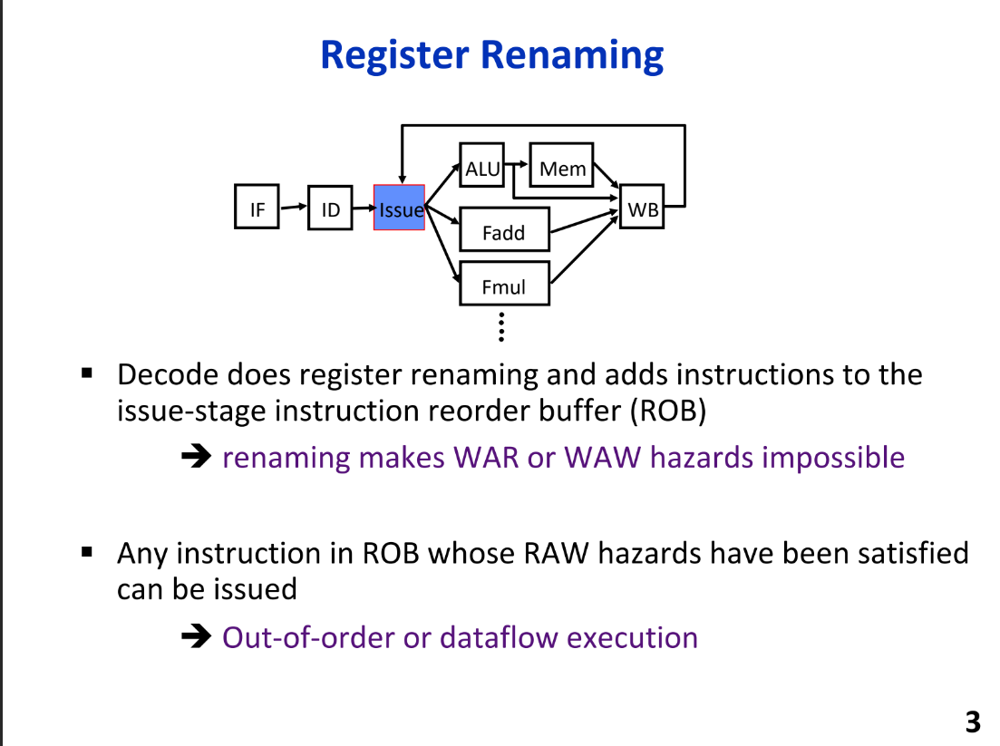
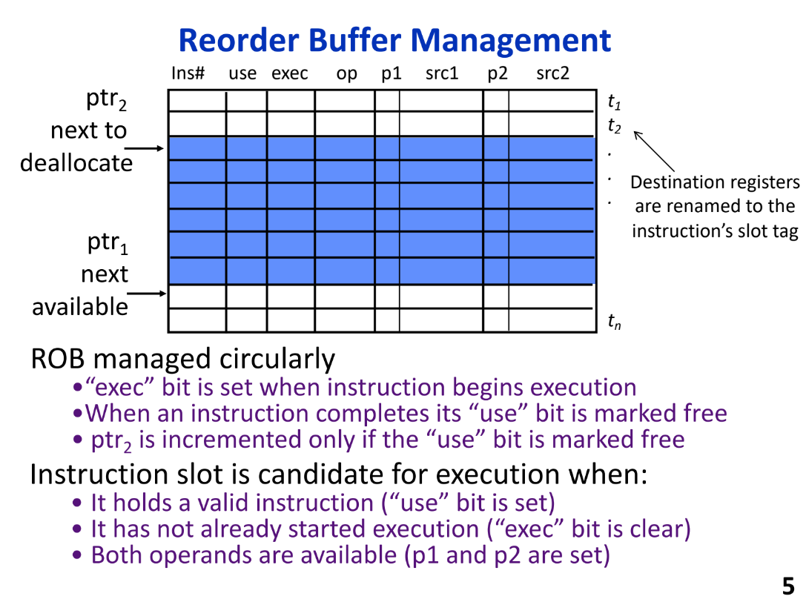
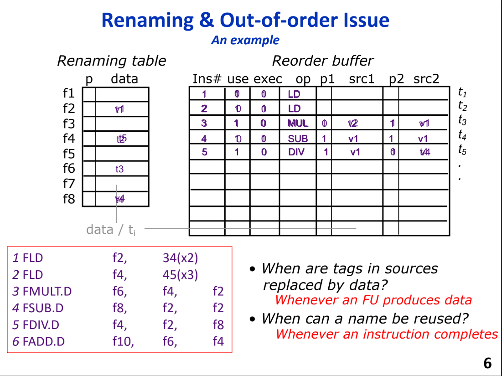
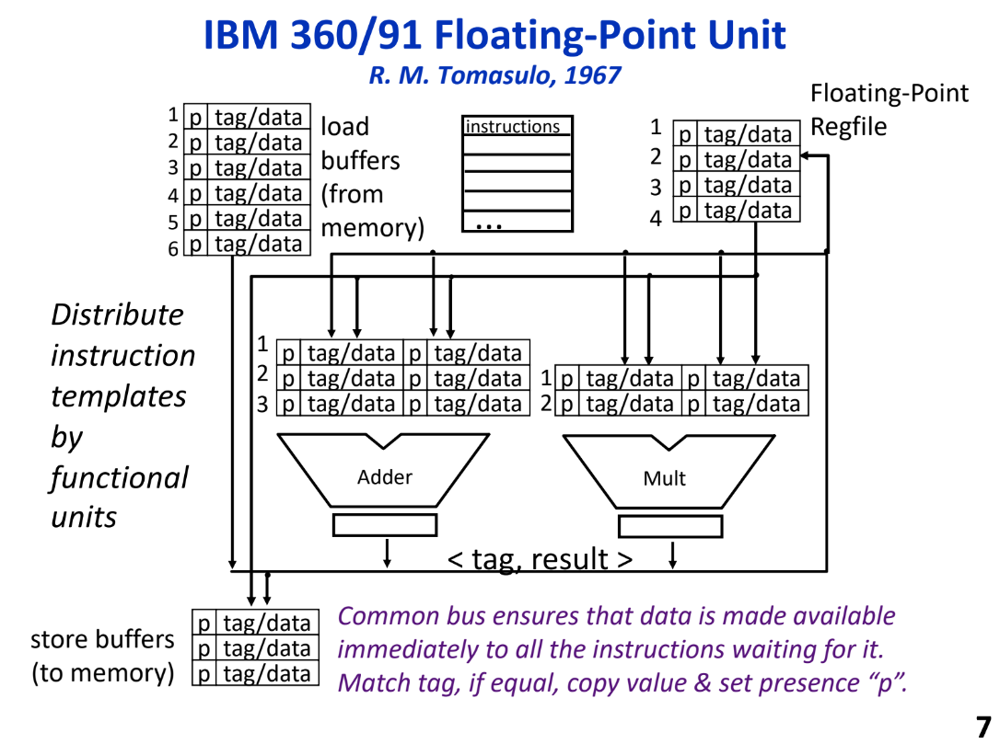
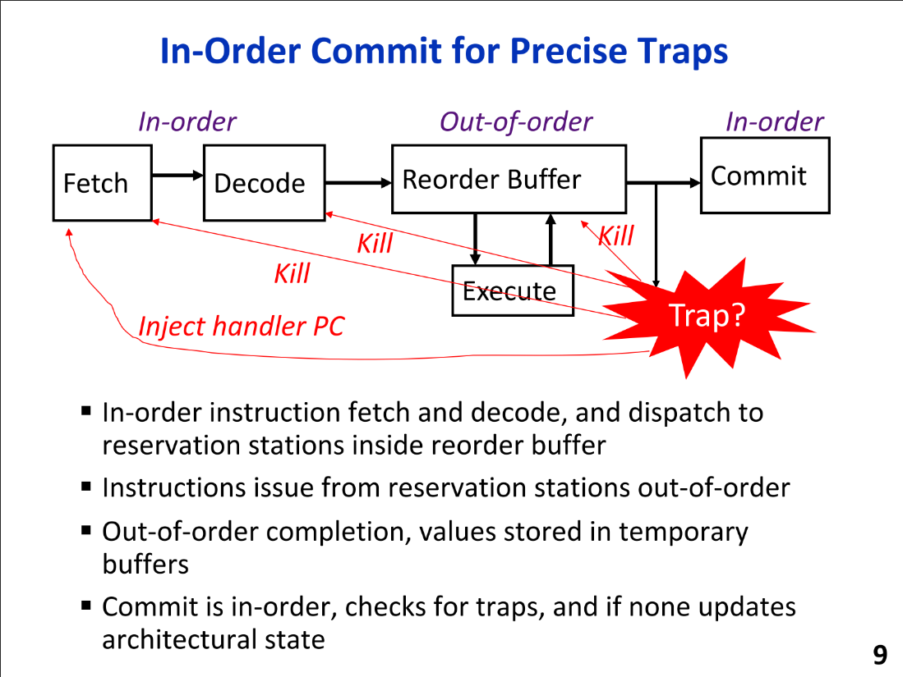
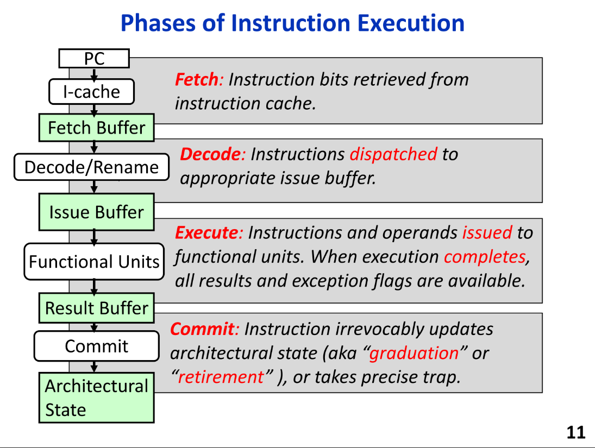
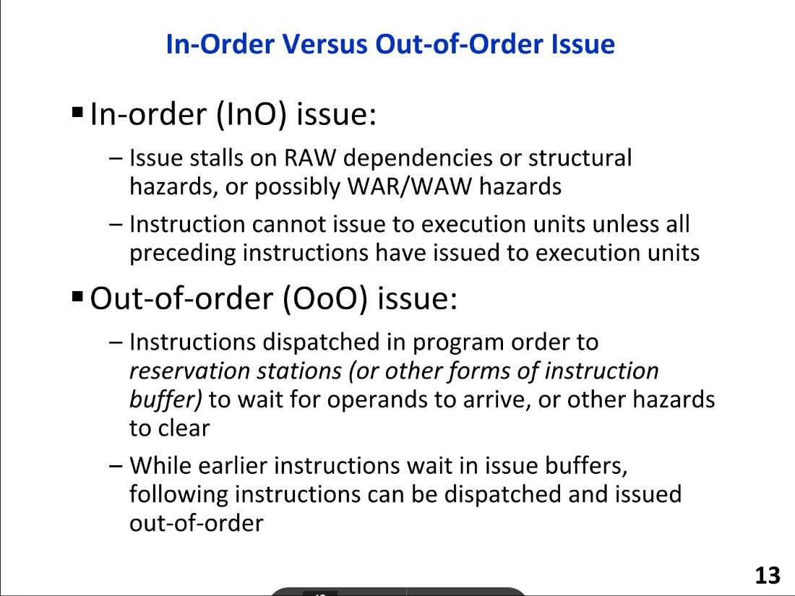
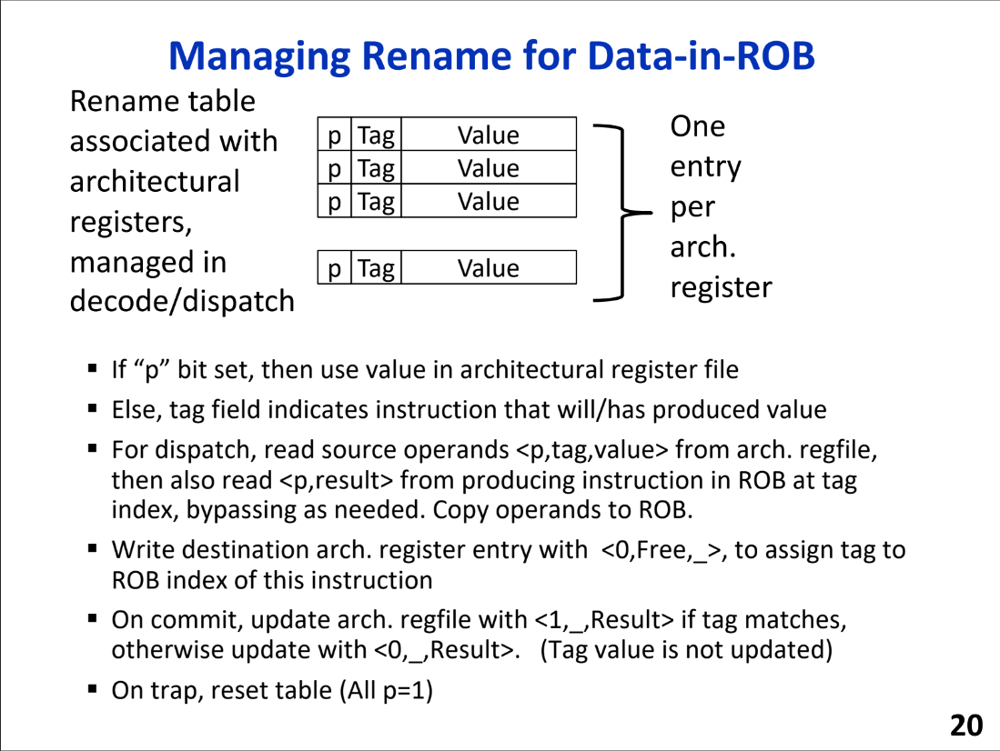
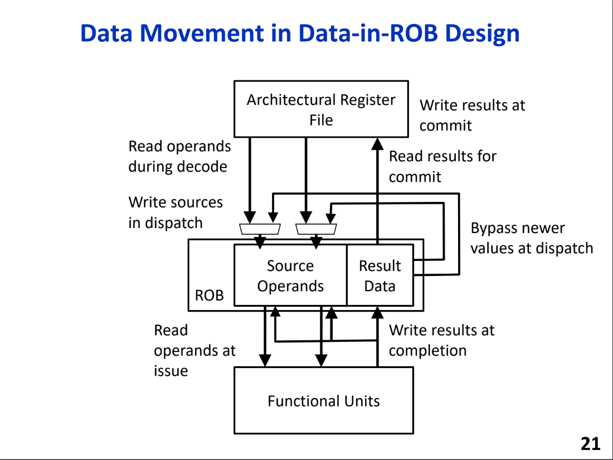
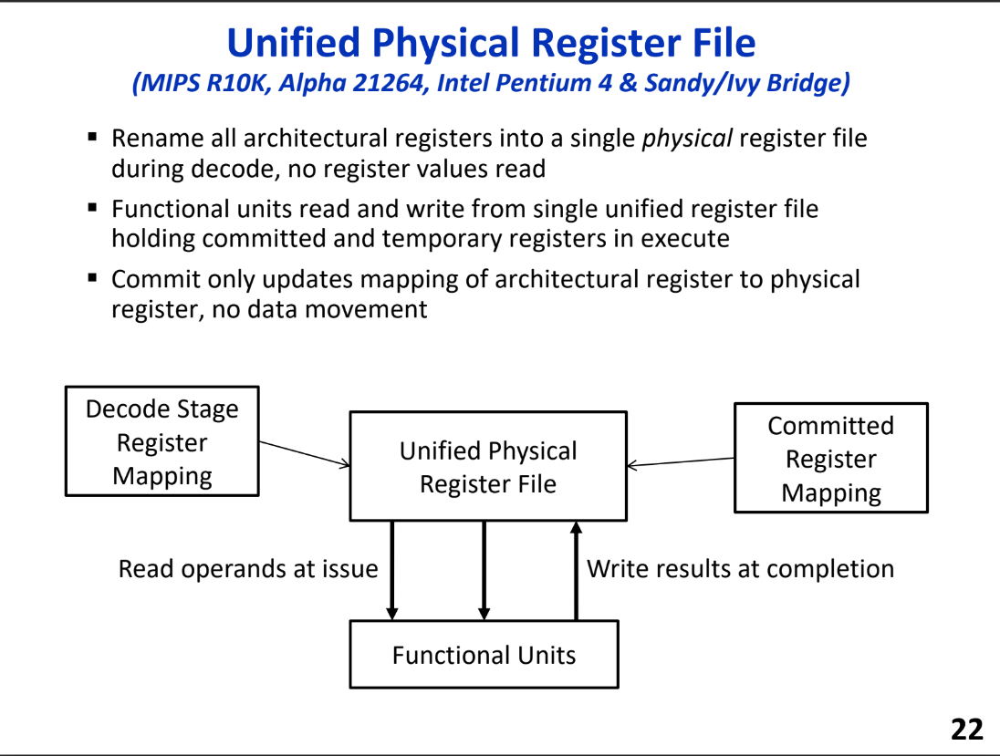

# Data in ROB

## 寄存器重命名

- 在译码阶段做寄存器重命名并且将指令添加到ROB中，这样在译码阶段读取的是物理寄存器的ID，这样解决了架构寄存器的数量不足的问题，消除了WAW和WAR冒险
- 在ROB中的所有指令，只要不发生RAW冒险就可以发射，这样做到了乱序执行

## 重命名结构

- tag：t1，t2，tn，这里的ROB中的tag即是我们对应的物理寄存器的ID
- 当我们在功能单元FU产生结果的时候，这里的tag需要通过广播机制和ROB中每一个entry中的源寄存器对应起来，因为这些src标记了依赖关系。同时还需要将结果广播会regfile

## ROB管理

- 概念上是一个环形缓冲区，通过ptr1和ptr2指针确定有效区域
- 当指令开始执行时，exec位置1，即没有依赖关系
- 在ROB中保留了顺序提交的视图，这样方便实现精确异常

## 重命名示例

- commit时按照ROB的头指针的顺序提交
- 每一次广播都需要比较，这里的消耗比较大，考虑如何优化
  
## Tomasulo算法 

- 分布式缓存，每一个FU都有一个保留站
- 现代的处理器中保留站的数目达到上千个，所以拥有高效的分支预测部件很重要

## 精确中断

- completion和commit的区别，乱序执行，顺序提交，实现程序原来的语义
- ROB中保存那些completion但没有commit的寄存器结果
- 在decode阶段，entry按照程序的顺序进行分配

## 指令执行过程

- 取指/译码/重命名阶段一直是顺序的，按照ISA的语义执行
- Dispatch就是将指令放入类似ROB中的缓存中等待issue也是有序的，Dispatch在本课中只是意味着填充Buffer
  
## 顺序发射和乱序发射

- 指令不能issue到FU，除非之前的所有指令全部issue
- 当遇见冒险时，issue会暂停

## OoO设计选择

- 跟踪指令间这种依赖的关系的保留站应该存放在ROB的一部分还是分开的issue窗口
- 集中还是分布式

## 寄存器重命名的实现方式
- 使用ROB实现寄存器重命名
在ROB和逻辑寄存器中都存在寄存器的结果；只要ROB空闲，重命名过程就可以实现；对于没有目的寄存器的指令也会分配一个ROB的表项，所以造成了浪费。
- 将逻辑寄存器扩展实现寄存器重命名
使用一个独立的存储部件，存储流水线中所有指令的结果
- 使用统一的物理寄存器实现寄存器重命名
将ARF和PRF进行合并，合并后的部件称为统一的PRF，存储所有推测的和正确的寄存器值；没有和指令产生映射关系的都是寄存器都是空闲状态

- 这里的ROB是原始的Tomasulo算法中保留站的超集，支持精确中断，实现顺序的commit
- data的复制开销和tag的比较开销较大，而且需要不断的复制data。

## ROB中的数据移动

## Unified Physical Register File

## 统一的物理寄存器文件

