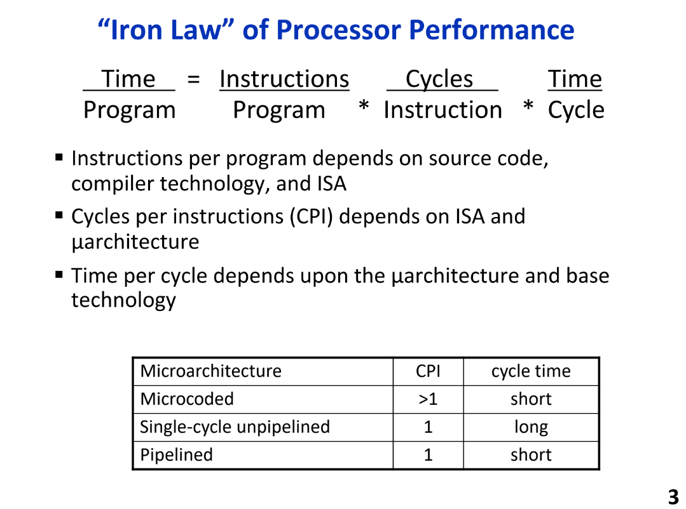
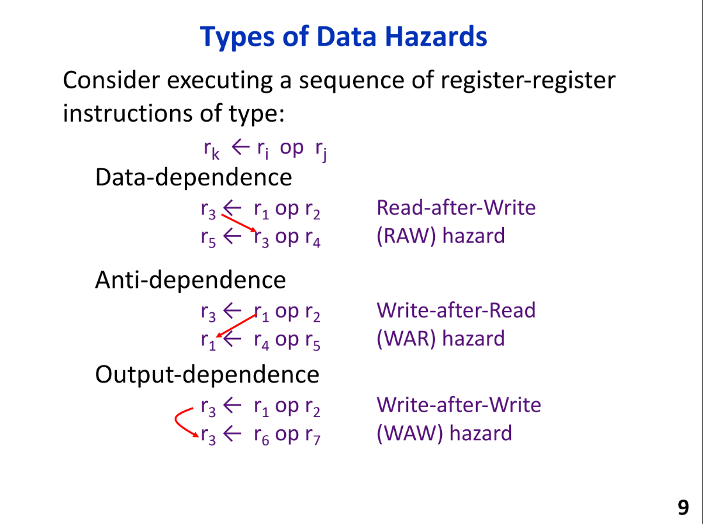
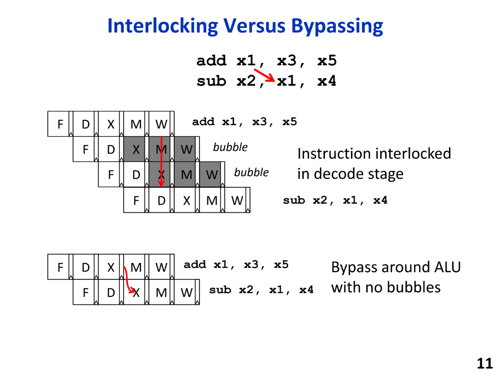

## 处理器性能计算公式

- instruction/program依赖于源码的大小，编译技术，和ISA的选择，比如可以通过将RISC换成CISC
- CPI是执行每条指令需要的周期数，依赖于ISA和微架构的实现，对于理想流水线CPI=1，注意CPI是一个吞吐量指标，指的是每一cycle能graduate的指令数量，可以通过以下技术改善cpi:
```
bypassing
branch prediction

```
- 频率依赖于微架构的实现，满足timeing约束，同时依赖于物理技术
- 这三者之间存在trade-off

## 冒险解决
### Resolving Structural Hazards
- Structural hazard occurs when two instructions need same hardware resource at same time
    - stall新指令直至旧指令利用完resource
    - adding more hardware to design
### Types of Data Hazards

### Three Strategies for Data Hazards
- Interlock(Stall): 在issue阶段一直保留dependent instruction直到hazard被clear
- Bypass: forwarding
- Speculate: guess the value
