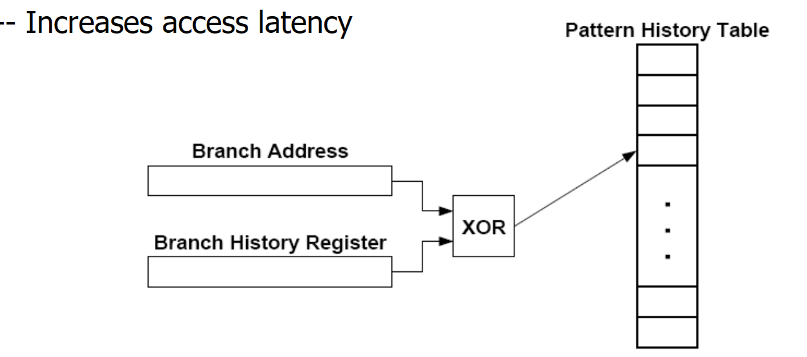
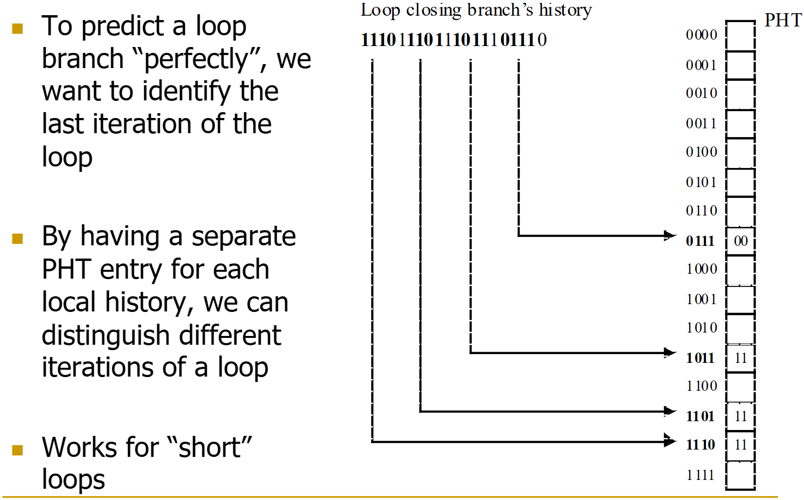
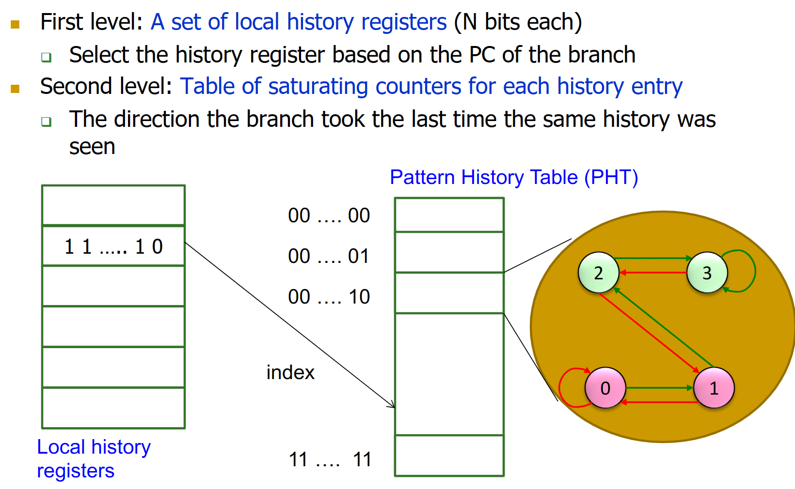
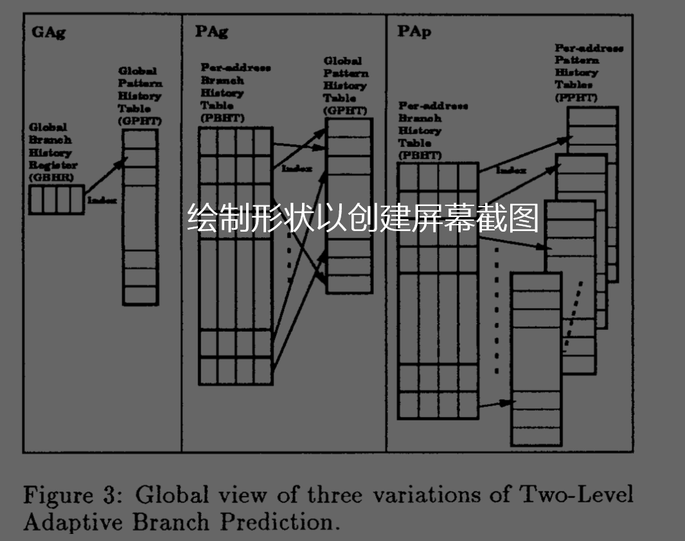

# 控制依赖处理
- 控制依赖:在流水线中，下一个cycle时用来取指的PC理论上是下一条应该执行的指令的地址，所有指令都依赖于前一条指令
    - 对于当前fetched的指令是非控制指令，如果ISA规定的instruction size确定，很容易计算出来，即nextPC = PC + size，对于X86可能需要在decode阶段知道size
    - 对于控制指令，情况比较复杂，首先如何确定当前指令是否是控制指令，通常这也需要在decode阶段
- 分支类型
主要从在取指时的跳转方向、跳转时PC的选择以及计算出nextPC的阶段，对于addr固定在inst中，通常在decode阶段可以得到指令的地址，对于间接跳转通常需要早execution阶段得出目标地址         

- 如何处理分支依赖
    - stall流水线知道nextPC计算出来
    - Guess 下一条指令的地址，branch predction
    - 利用分支延迟，分支延迟槽，branch delay slot
    - 利用分支延迟，做一些其他事情，fine-grained multithreading
    - 减小分支延迟指令，predicated execution
    - multipath execution

# 静态分支预测

# 动态分支预测
## Two-Bit Counter Based Predictor

## Two-Level Predictor
与其只看一个level的branch历史，这主要是利用last time分支的历史，不如尝试看2层level的历史，这就是two level的由来，考虑以下两点：

- 一个分支的结果可能与其他分支相关，即`Global branch correlation`
- 一个分支的结果可能与past outcomes of the same branch相关，而不仅仅是"last time"，这主要体现在look at the longer pattern，即`Local branch correlation`。例如，对于`TNTNTNTNTNTNTNTNTNTN`，对于初始化为weakly taken的两位饱和计数器，将会一直在weakly taken和strongly taken之间的状态循环，导致准确度只有50%,如果能观察到到long pattern，就会发现`TNTN`的规律

### Global Branch Correlation 
##### Global history
对于一条分支指令进行预测时，考虑到前面分支指令的执行结果，这种方法称为全局历史(Global history)的分支预测，比如一下程序：
```c
if(aa == 2) /b1/
    aa = 0
if(bb == 2) /b2/
    bb = 0
if(aa != bb) /b3/
```
如果b1和b2执行，b3肯定不会执行

- idea:将分支结果和所有分支的"global T/NT history"联系起来，预测的结果采用GHR的值来预测
- implementation:将"global T/NT history" of all branch记录在Global History Register(GHR)中，然后使用GHR去index Pattern History Table(PHT)这张表，表中记录在最近的过去看到的GHR的value，这个value可能通过2位饱和计数器来存储.
- two level：即GHR + history at that GHR
  
如图所示：
- GHR是个寄存器，用来编码先前分支的方向，这里是最后N个分支的方向


- 对于示例代码，有内外两个循环，对于最外层的循环，测试i<100，最近的三次branch测试j，得到的历史是`TTN`，在最近的第四次测试的是branch i，得到的历史是T，所以最后四次分支历史是`TTTN`，当每次看到`TTTN`这种history的时候，最好预测为taken，这种情况下不需要知道当前分支是test 4，但是观察到history `TTTN`，以此来预测。
- 对于test(j=1)，当前的history是`TTNT`，此时为taken
- 对于test(j=2)，当前的history是`TNTT`，此时为taken
- 对于test(j=2)，当前的history是`NTTT`,此时为not
taken


##### Improving Global Predictor Accuracy

- idea: 通过考虑which branch is being predicated，给global predictor添加更多的上下文信息，比如分离的PHT
- Gshare predictor:使用GHR和branch PC一起hash来索引PHT



### Local Branch Correlation
对于下面的循环代码:
```c
for(i=1;i<=4;i++)
```
如果在body结尾测试loop，当前对应的分支会执行$(1110)^{n}$这种模式，其中n表示loop执行的次数，即如果知道当前branch之前三次的历史，则当前分支指令的预测结果可能为0，具体的预测如下图:

- 能够准确的预测loop，识别出loop的最后一次迭代
- 不同的local history设置不同的PHT，可以区别不同的loop
- 非常适合较短的loop


这种方式也是two level的预测
- 第一级:
- 第二级:


### Two-Level Predictor Taxonomy
two-level的分支预测器的分类方法：
- BHR可以是:Global(G), per set of branches(S), per branch(P)
- PHT可以是:Global(g), per set of branches(s), per branch(p)
- 对于BHR这里的Global是指只有一个全局的GHR寄存器，存放全局的last n times分支指令的预测历史，而对于per set of branches则是用PC中some bits来寻找记录当前指令的local分支历史，可能遇见aliasing，但是如果使用per branch，即每个branch的PC都有自己独立的BHR，硬件开销很大
- 对于PHT这里的Global也是考虑到如果每一个branch指令都有对立的PHT硬件开销很大，但从实际出来，对一个BHR来说，只会用到PHT中的少部分内容，这样多个BHR可以使用PHT中的不同部分，可以最大限度的利用PHT中的计数器，同时per branch也是利用PC中的some bits来寻找PHT，后面两种情况都会遇见冲突问题


### Hybrid Branch Predictors


# 例题
