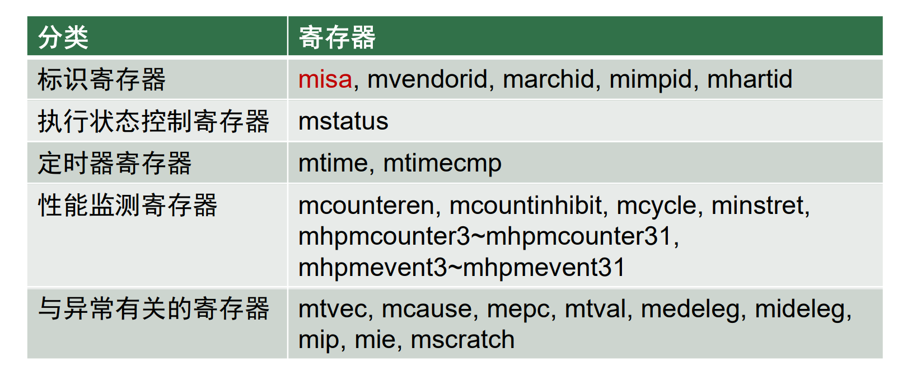
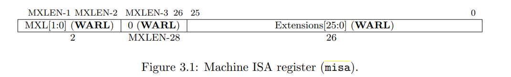
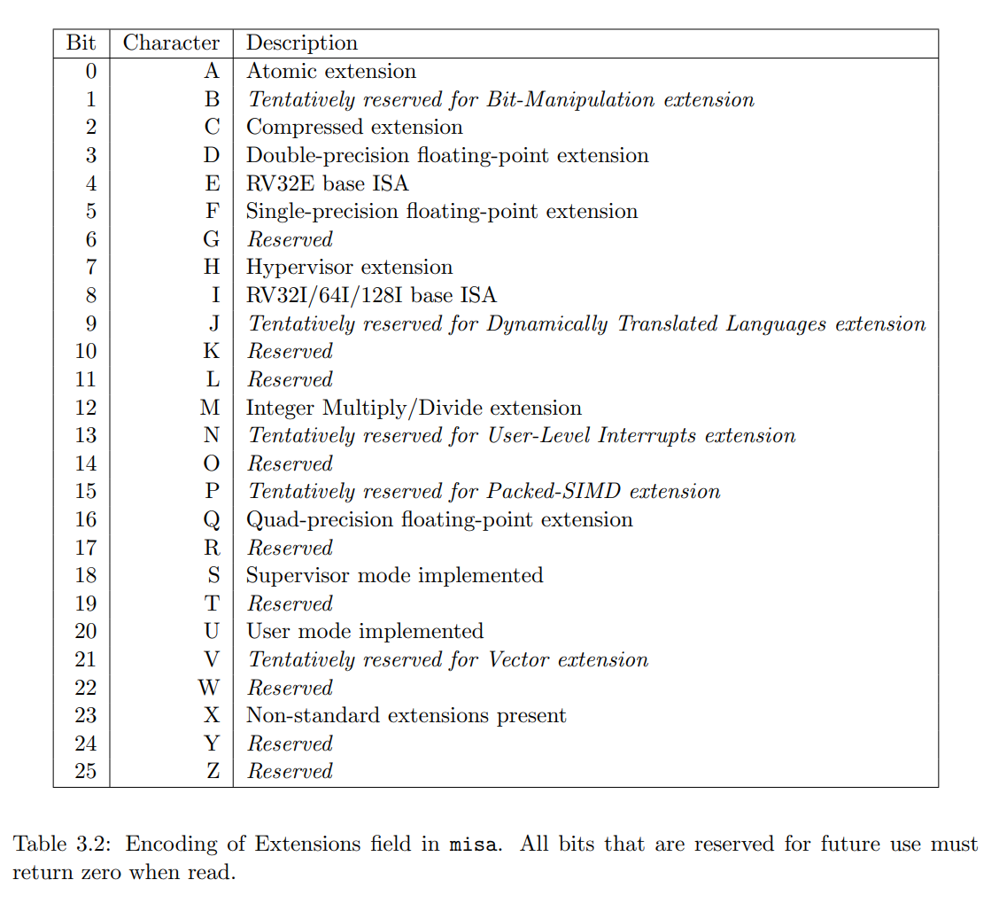
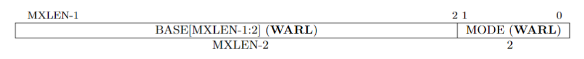
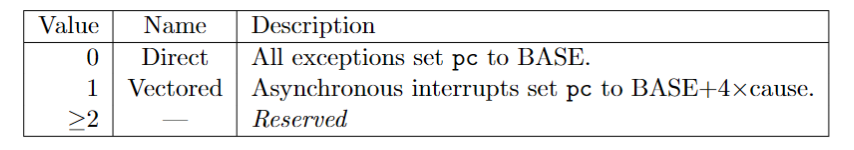
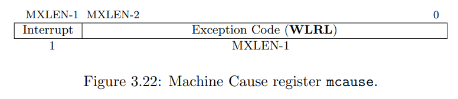
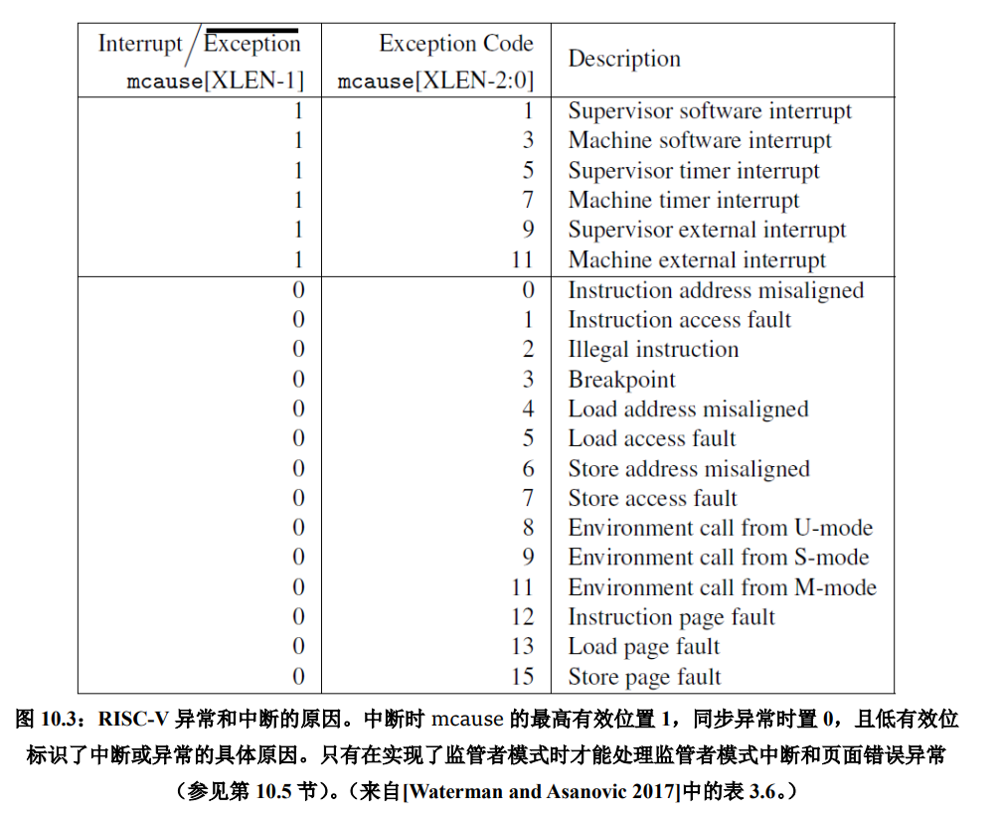
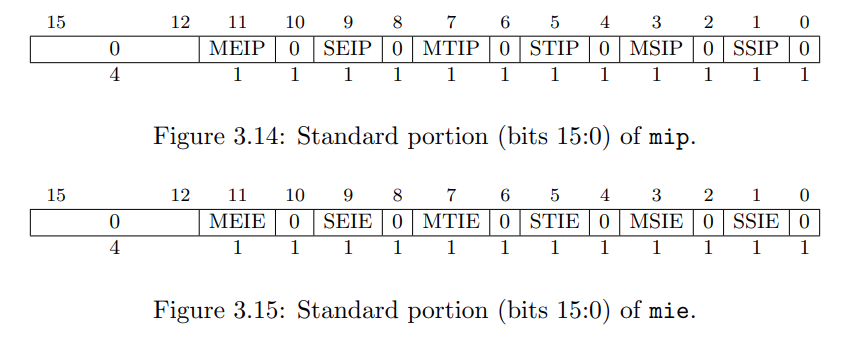
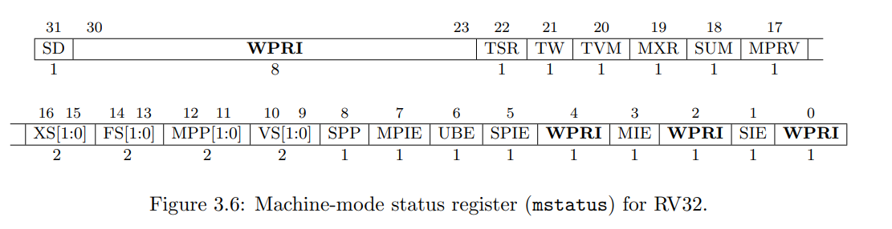

# RISCV特权级架构
## Machine模式

### 标识寄存器
- misa:标识处理器支持的指令集模块
    - 如果读出0，表示处理器没有实现该寄存器
    - `MXL[1:0]`:1表示RV32，2表示RV64，3表示RV128
    - `Extensions[25:0]`:表示实现的指令集扩展，从0-25位分别对应[A-Z]26字母，0表示未实现，1表示实现
    - 4位的`E`位是只读的，且`misa[4]=~misa[8]`，如果要同时实现RV32E和RV32I可以通过将`I`置零选择RV32E
    - 如果扩展e1依赖于e2，那么e2没有实现时，e1也被禁用
    - `[23]`表示实现了定制扩展
    - 通过misa.MXL[1:0]、misa[4]、misa[8]来判断基本整数指令集模块

### 异常处理相关CSRS
- mtvec:保存异常发生时处理器需要跳转的地址
    - `BASE`，中断处理程序入口地址，字段需要4字节对齐
    - `MODE`: 决定如何生成异常访问表地址，0即`DIRECT`模式，入口地址为`BASE`，1即`VECTORED`模式，入口地址为`BASE + 4 * cause`，对齐的要求更严格

- mepc:指向发生异常时的指令
- mcause:指示发生异常的种类和原因
    - Interrupt:0表示同步异常，1表示中断
    - Exception code: 同步异常或者中断的编号
    

- mtval:如果在实现定义的时间内没有执行完毕，那么处理器进入低功耗状态
    - 发生故障的虚地址:address-misaligned
    - 发生故障的指令的编码:illegal instruction
    - 全0:其他异常

- medeleg&mideleg:在任何特权级的所有trap默认情况下在M态处理，通过`mret`返回，`medeleg`用于保存哪些异常要委托给 S 模式进行处理，`mideleg`用于保存哪些中断要委托给 S 模式进行处理，需要委托哪些中断 / 异常，就将对应寄存器的对应位设置为 1，不需要委托就设置为 0

- mip&mie:`mie`指出处理器目前能处理和必须忽略的中断，`mip`则列出目前正准备处理的中断
    - MIE:M态外部中断，MTI:M态定时器中断，MSI:M态软件中断，S的类似
    - mie保存的是每一种中断的局部使能，中断能够响应还需要收`mstatus`中`MIE`中断全局使能控制位的控制

- mscratch:
- mstatus:跟踪处理器的当前操作状态、控制处理器的执行
    - 特权级和中断全局使能位的数据栈
        - MIE：M态中断全局使能位
        - SIE：S态中断全局使能位
        - 可以用来实现某特权级下中断处理的原子性
        - xPP:x模式中断处理前的特权级别
        - xPIE：保存处理器进入x态之前的中断全局使能位
        - 当处理器在y态发生异常进入x态时,xpp的值被置为y,xpie的值为xie的值,xie被置为零
    - 基本整数指令集控制位
    - 数据访问字节序控制位
    - 扩展指令集的上下文状态位

### 系统指令
- mret和sret:xRET只能在x态或高于x态的特权级执行，低于x态的特权级执行将产生非法指令异常
- 执行xRET指令时，处理器需要恢复异常发生时的现场
    - 处理器返回`mstatus.Xpp`指定的特权级,并将`mstatus.Xpp`清零
    - `使用mstatus.xPIE`更新`mstatus.xIE`，并将`mstatus.xPIE`置为1
    - 跳到`xepc`指定的地址
- WFI:暗示处理器可以进入一种低功耗状态，直到被中断
唤醒,可以在任意特权级执行,只是行为有所不同
    - U态下WFI的行为:如果在实现定义的时间内没有执行完毕（在这个时间内有中断请求，WFI指令没有令处理器进入低功耗状态，而是继续执行后续指令），那么发生非法指令异常进入高特权级
    - S态下WFI的行为:
        - mstatus.TW=0:如果在实现定义的时间内没有执行完毕，那么处理器进入低功耗状态
        - mstatus.TW=1:如果在实现定义的时间内没有执行完毕，那么发生非法指令异常
    - M态下WFI的行为:如果在实现定义的时间内没有执行完毕，那么处理器进入低功耗状态

## 中断处理流程
当hart发生异常时,硬件自动完成下面的状态转换:
- 异常的pc被保存在`mepc`寄存器中,pc被设置为`mtvec`,对于同步异常,mepc指向导致异常的指令,对于中断,指向中断处理后恢复执行的位置
- 根据异常来源设置`mcause`,并把`mtval`设置为出错的地址或者其他异常信息
- 把`mstatus`的MIE置零用来禁用中断,并把先前的MIE的值保存到MPIE中
- 把发生异常的权限模式保存在`mstatus`的MPP中,在把权限模式更改为M

## Supervisor模式

## 虚拟存储
- SFENCE.VMA:

## 指令动态调度
### Scoreboard
1.Issue(流出):当前的指令需要的功能部件空闲(避免结构冒险),并且没有其他活动的指令使用相同的目的寄存器,避免`WAW`;
如果发生上述冲突,当前指令和未来的指令都会被`stall`在Issue站,直至冒险消除,说明所有指令是`In-Order`流出的;
如果没有检测出冲突,Issue当前指令,并且更新`scoreboard`

2.Read operands(读操作数):检测`RAW`冒险,所有的源操作数是否都可用,即之前发射的正在执行的指令不对当前指令的源寄存器进行写操作或者已经完成了对源操作数寄存器的写操作
- Ok:记分牌控制功能部件读操作数，准备执行
- NO:将当前指令保存在`I-Buffer`,当操作数就绪时,乱序调度执行

3.Execution:接收到操作数后，功能部件开始执行. 当计算出结果后，它通知记分牌，可以结束该条指令的执行

4.Write result:检测`WAR`冒险

### 